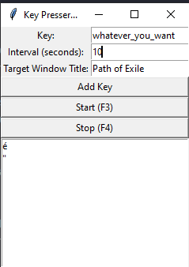

# Key Presser App

A Python GUI application that simulates key presses at regular intervals. The key presser only works when a specified application window is in focus, and stops when you switch to another application.

## Features

- Set multiple keys to be pressed.
- Define the interval between key presses.
- Specify the target window title for the key presser to work.
- Start and stop the key presser using keyboard shortcuts (F3 to start, F4 to stop).
- Responsive GUI that scales with the window size.

## Installation

### Prerequisites

- Python 3.10 or higher
- Poetry (for dependency management)

### Steps

1. Clone the repository:
    ```sh
    git clone https://github.com/yourusername/key_presser_app.git
    cd key_presser_app
    ```

2. Install dependencies using Poetry:
    ```sh
    poetry install
    ```

3. Run the application:
    ```sh
    poetry run python key_press_app/__main__.py
    ```

## Usage

1. **Set the Target Window Title**:
    - Enter the title of the application window you want the key presser to work with in the "Target Window Title" field. The default value is "SomeWindow".

2. **Add Keys to be Pressed**:
    - Enter the keys you want to be pressed in the "Key" field and click "Add Key". Repeat this step to add multiple keys.

3. **Set the Interval**:
    - Define the interval (in seconds) between each key press in the "Interval (seconds)" field.

4. **Start and Stop the Key Presser**:
    - Click "Start" to begin the key pressing process. The keys will only be pressed when the specified window is in focus.
    - Click "Stop" to stop the key pressing process.
    - Use the F3 key to start and the F4 key to stop the key presser.
    



## Building the Executable

2. Build the executable:
    ```sh
    poetry run pyinstaller --name key_presser_app --onefile main.py
    ```

3. The executable will be located in the `dist` directory.